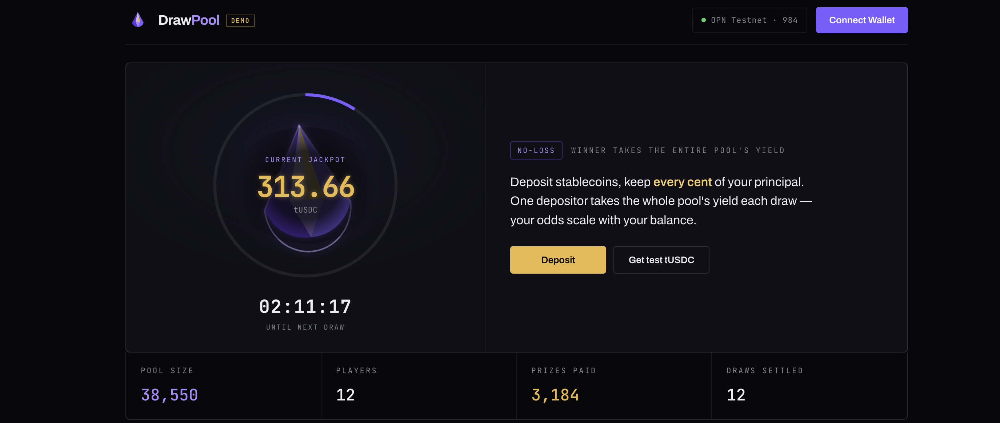

# DrawPool

**No-loss prize savings on OPN Chain.** Deposit tUSDC, keep 100% of your principal, and route the pool's yield to one saver each draw, with odds proportional to balance.



## Demo

- Live app: [drawpool.xyz](https://drawpool.xyz)
- Direct Vercel deployment: [drawpool-phi.vercel.app](https://drawpool-phi.vercel.app/)
- Self-contained preview artifact: [`drawpool-preview.html`](./drawpool-preview.html)

## Contracts

| Contract | Address |
| --- | --- |
| `DrawPool` | [`0x70FE611Eded4e930f361e298C1B222E12088c573`](https://testnet.iopn.tech/address/0x70FE611Eded4e930f361e298C1B222E12088c573) |
| `MockUSDC` | [`0x657B76E29a81F22C66155acCb1fAc7F0B15c8401`](https://testnet.iopn.tech/address/0x657B76E29a81F22C66155acCb1fAc7F0B15c8401) |
| `SponsoredYieldSource` | [`0xFC96922990e7FC152A398029cee8f6F162532441`](https://testnet.iopn.tech/address/0xFC96922990e7FC152A398029cee8f6F162532441) |
| `FinalityRandomness` | [`0x649636f3eE9F74dA7AE276ea7aa28c354Db0cEba`](https://testnet.iopn.tech/address/0x649636f3eE9F74dA7AE276ea7aa28c354Db0cEba) |

## How to verify

1. Open [`DrawPool` on the OPN explorer](https://testnet.iopn.tech/address/0x70FE611Eded4e930f361e298C1B222E12088c573).
2. Confirm the contract has live activity, including the first `deposit(100 tUSDC)` transaction: [`0xafe07bd948046ec8fedaf16b19ca8765500df985729c2f68c4f2dbd1f07b98d9`](https://testnet.iopn.tech/tx/0xafe07bd948046ec8fedaf16b19ca8765500df985729c2f68c4f2dbd1f07b98d9).
3. Compare the on-chain addresses with [`frontend/config.js`](./frontend/config.js) and [`contracts/deployment.json`](./contracts/deployment.json).

## How it works in 3 steps

1. Deposit tUSDC into the pool. Principal stays withdrawable 1:1.
2. Yield accrues on top of pooled principal and becomes the next draw's payout.
3. The contract commits to a future OPN block, then pays the full yield prize to one saver with balance-weighted odds.

Built for **IOPn Builders, Season 1: DeFi & Open Finance**.

> Principal is always withdrawable 1:1. You can only ever win, never lose.

---

## Why this is load-bearing on OPN Chain

A prize-savings protocol lives or dies on its randomness. The interesting part is
that DrawPool's randomness is sound **specifically because of OPN's consensus
guarantees**, not in spite of them.

`FinalityRandomness` derives each draw's entropy from a **future, finalized block
hash**. On Ethereum this is a textbook anti-pattern: blocks can reorg, so a
proposer who dislikes an outcome can rewrite it, and `blockhash` is unreadable
beyond 256 blocks. OPN Chain runs **Tendermint BFT with instant finality and no
reorgs** (per the OPN docs). Once the committed block is produced it is final
forever — its hash cannot be rewritten after the fact — and **~1s block times**
keep the commit→reveal window down to a few seconds. The same fast finality is
what makes the brief deposit-lock during a draw painless.

So the design leans directly on the two things OPN actually differentiates on
(instant finality, 1s blocks), rather than wrapping a generic EVM trick. It is
*not* a toy integration.

### Honest threat model

The proposer of the committed block still influences its hash and could grind or
withhold to bias a single draw. For a hackathon MVP with testnet stakes this is
acceptable and disclosed up front. Crucially, randomness sits behind the
`IRandomnessSource` interface, so a verifiable VRF drops in **with zero changes to
`DrawPool`** the moment OPN ships a native oracle (their docs list Chainlink and a
native oracle as "coming soon"). That migration path is the roadmap, not an
afterthought.

---

## Architecture

```
            ┌────────────────────────────────────────────┐
            │                 DrawPool                    │
            │  deposits · weighted draws · no-loss exits  │
            └───────────────┬──────────────┬─────────────┘
                            │              │
               IYieldSource │              │ IRandomnessSource
                            ▼              ▼
              ┌──────────────────┐  ┌────────────────────┐
              │ SponsoredYield   │  │ FinalityRandomness │
              │ Source (testnet) │  │ (future-blockhash) │
              └──────────────────┘  └────────────────────┘
                  swappable for         swappable for a
                  lending/staking       native VRF later
```

Both dependencies are **interfaces**. The pool never changes when the yield
backend or randomness backend is upgraded — that is the whole point of the seams.

### Contracts (`contracts/src`)

| Contract | Role |
| --- | --- |
| `DrawPool.sol` | Core. Deposit/withdraw (1:1, no-loss), permissionless `startDraw`/`award`, balance-weighted winner selection, prize auto-compound, pool lock spanning a draw. |
| `FinalityRandomness.sol` | Commit-to-future-block randomness beacon, anchored to OPN instant finality. Self-heals if the 256-block window lapses. |
| `SponsoredYieldSource.sol` | Testnet yield adapter. Principal held 1:1; yield funded by a sponsor reserve that drips at a fixed rate, for a continuous self-running demo. |
| `interfaces/IYieldSource.sol`, `interfaces/IRandomnessSource.sol` | The upgrade seams. |
| `testnet/MockUSDC.sol` | 6-decimal test stablecoin with a public faucet (no live USDC bridge on OPN testnet yet). |

### Mechanism notes

- **No-loss:** principal goes to the yield source and is always redeemable 1:1.
  Only yield *on top of* principal is ever raffled.
- **Fair odds:** at draw time the pool is locked, so live balances equal the
  start-of-draw snapshot; the winner is chosen by walking cumulative balances
  against `random % totalDeposited`.
- **Auto-compound:** the prize is supplied back as the winner's principal, so
  winners' future odds rise — a deliberate "savings momentum" dynamic (verified in
  tests: an 80%-weight depositor wins the large majority of repeated draws).

---

## Scoring rubric, addressed directly

| Criterion (weight) | How DrawPool answers it |
| --- | --- |
| **OPN Chain Integration (30%)** | Randomness is sound *only* on OPN's instant-finality/no-reorg consensus; fast finality enables the short draw lock. Deployed and transacting on OPN testnet (chain 984). |
| **Technical Quality (25%)** | Solidity 0.8.30, OpenZeppelin, interface-segregated upgrade seams, `ReentrancyGuard`, custom errors. Full lifecycle + statistical test suite, all passing. |
| **Product & UX (20%)** | A real consumer savings product with instant comprehension: deposit, keep principal, win yield. The UI shows the next yield prize, balance-weighted odds, recent draws, and verifiable block-finality proof in one screen. |
| **Innovation (15%)** | First no-loss prize-savings primitive on OPN, and a randomness construction that turns OPN's finality into a feature instead of working around an EVM limitation. |
| **Builder Commitment (10%)** | Documented VRF migration path tied to OPN's own oracle roadmap; clean seams signal a maintainable, long-term build. |

---

## Run it

### 1. Contracts

```bash
cd contracts
npm install
node compile.js                 # compiles with bundled solc 0.8.30 -> out/
node test/run.js                # full lifecycle + statistical tests (local EVM)
```

### 2. Deploy to OPN testnet

```bash
cp .env.example .env            # add your PRIVATE_KEY
node deploy.js                  # deploys all 4 contracts, seeds a sponsor reserve
```

`deploy.js` writes `deployment.json` and emits `frontend/config.js` +
`frontend/abi.js` so the UI is wired automatically.

For a fast demo set `DRAW_INTERVAL=300` (5-minute draws) in `.env`.

### 3. Frontend

The UI is a static bundle in `frontend/` (`index.html`, `styles.css`, `app.js`,
plus `config.js`/`abi.js` written by `deploy.js`, and an optional React tweaks
panel). No build step — just serve the folder.

```bash
cd frontend
python3 -m http.server 8080     # or deploy the folder to Vercel / Netlify
```

Open <http://localhost:8080>. Before contracts are wired it runs in demo mode
(flagged "demo") with a full self-contained simulation: animated yield-prize orb,
odds donut, a draw lifecycle reel anchored to a finalized block hash, and
synthesized sound. Once `config.js`/`abi.js` exist and a wallet connects, the
same handlers run live against OPN testnet: faucet, deposit, withdraw, commit
draw, settle draw, balance-weighted winners, and the on-chain entropy
(`Draw.randomness`) shown per draw.

The optional tweaks panel is available automatically on `localhost` / `file://`,
or can be forced with `?tweaks=1`. On regular hosted pages it stays hidden unless
an edit-mode host explicitly activates it.

For a one-file visual handoff, `drawpool-preview.html` is a self-contained preview
artifact with the same core UI stitched into a single HTML file.

---

## Network

| | |
| --- | --- |
| Chain | OPN Testnet, ID **984** |
| RPC | `https://testnet-rpc.iopn.tech` |
| Explorer | `https://testnet.iopn.tech` |
| Gas | fixed 7 Gwei |

## Roadmap

1. Swap `FinalityRandomness` for a verifiable VRF once OPN's native oracle ships.
2. Replace `SponsoredYieldSource` with a lending/staking-backed adapter for
   organic, non-sponsored yield.
3. Multiple pools per asset and per cadence; delegated "deposit on behalf of".
4. A secondary market for pool positions (positions are ERC20-izable).

## License

MIT.
